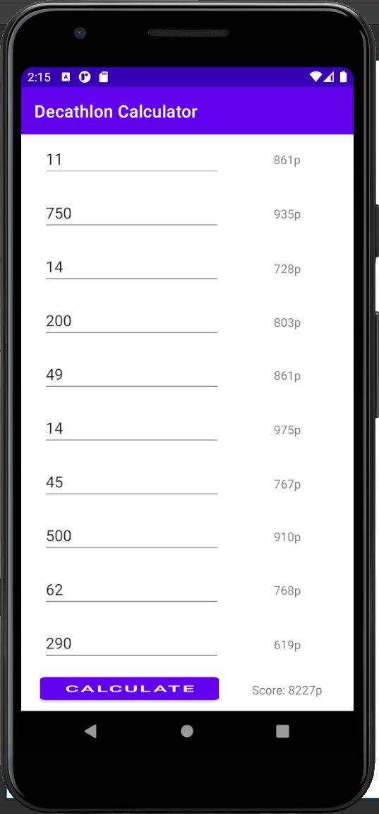

<h1>Decathlon Calculator</h1>

<ul>
  <li>Tõmba <a href="https://developer.android.com/studio">Android Studio</a>.</li>
  <li>Paigalda Android Studio ja lisa SDK 24, 29 ja 30.</li>
  <li>AMD protsessorite puhul mine BIOS'i ja lülita sisse SVM (Secure Virtual Machine).</li>
  <li>Käivita Android Studio ja impordi decathlon_calculator projekt.</li>
  <li>Vajutage "run" (roheline kolmnurk üleval paremas nurgas) ja seadistage ära Android emulator.</li>
  <li>Rakendus peaks nüüd töötama.</li>
</ul>

