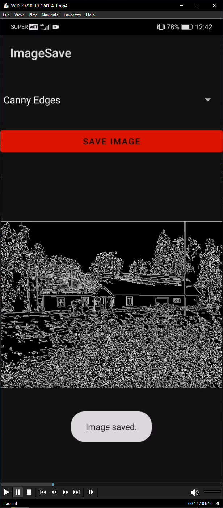

<h1>Mobiilirakenduste arendamine</h1>

Siia paneme mobiilirakenduste aines tehtud tööd.

<h2>Paigaldamisjuhend</h2>
<ul>
  <li>Lae alla <a href="https://developer.android.com/studio">Android Studio</a>.</li>
  <li>Paigalda Android Studio ja lisa SDK 24, 29 ja 30.</li>
  <li>AMD protsessorite puhul mine BIOS'i ja lülita sisse SVM (Secure Virtual Machine).</li>
  <li>Käivita Android Studio ja impordi valitud projekt sellest repost.</li>
  <li>Vajutage "run" (roheline kolmnurk üleval paremas nurgas) ja seadistage ära Android emulator.</li>
  <li>Rakendus peaks nüüd töötama.</li>
</ul>

<h2>Esimene ülesanne</h2>

Tegime lihtsa kümnevõistluse kalkulaatori.

Kerge oli:

<ul>
  <li>Nuppude ja tekstiväljade paigutamine.</li>
</ul>

Raske oli:

<ul>
  <li>Nuppude ja tekstiväljade haldamine läbi koodi.</li>
</ul>

<h2>Teine ülesanne</h2>

Teine ülesanne on lisatud kotlin.rtf failina.

<h2>Kolmas ülesanne</h2>

Tegime lihtsa mitmelehelise rakenduse, kust saab lugeda Androidi operatsioonisüsteemi kohta.

Kerge oli:

<ul>
  <li>Nuppude ja tekstiväljade paigutamine.</li>
</ul>

Raske oli:

<ul>
  <li>Mitme lehe haldamine.</li>
</ul>

<h2>Neljas ülesanne</h2>

Tegime rakenduse, mis teeb pildi ning muudab selle must-valgeks.

Kerge oli:

<ul>
  <li>Nuppude ja tekstiväljade paigutamine.</li>
</ul>

Raske oli:

<ul>
  <li>Kaamera kasutamiseks loa saamine.</li>
  <li>Pildi bitmapile ligi pääsemine ja selle töötlemine must-valgeks.</li>
</ul>

<h2>Viies ülesanne</h2>

Tegime AR rakenduse kasutades Google Sceneform pluginat.

Kerge oli:

<ul>
  <li>Plugina kasutamine, tuli lisada 3d mudel ja välja kutsuda pluginas ette kirjutatud meetodid.</li>
</ul>

Raske oli:

<ul>
  <li>Plugina lisamine projekti, kuna plugin on tänaseks aegunud.</li>
</ul>

<h2>Kuues ülesanne</h2>

Tegime lihtsa rakenduse, mis võimaldab kasutajal rakendusesiseselt pilti teha, pilt salvestatakse automaatsel. Teises activity's laetakse tehtud pilt sisemälust uuesti rakendusse ja kasutaja saab lisada pildile lihtsaid efekte, valitud efektid salvestatakse järgmiseks korraks.

Kerge oli:

<ul>
  <li>Nuppude ja tekstiväljade paigutamine.</li>
  <li>Pildile efekti rakendamine.</li>
</ul>

Raske oli:

<ul>
  <li>Pildi salvestamine.</li>
</ul>

<h2>Seitsmes ülesanne</h2>

Tegime võrgurakenduse kasutades Volley HTML teeki. Rakendus teeb POST ja GET päringuid <a href="https://reqres.in/">reqres</a> lehele.

Kerge oli:

<ul>
  <li>Nuppude ja tekstiväljade paigutamine.</li>
</ul>

Raske oli:

<ul>
  <li>Päringute tegemine.</li>
  <li>JSON'ist info kätte saamine ja kuvamine tekstiväljal.</li>
</ul>

<h2>Kaheksas ülesanne</h2>

Kaheksas ülesandes pidime rääkima oma viimasest projektist. Meie viimane projekt on edasiarendus kuuendast ülesandest. Teeme rakenduse, kus saab pilti teha või sisse importida, seda pilti saab töödelda sellele filtreid rakendades. Töödeldud pilti saab salvestada. Appist saab avada galerii, et salvestatud pilte vaadata.

<h2>Viimane ülesanne (Lõpuprojekt)</h2>

Tegime rakenduse, kus saab pilti teha või sisse importida, seda pilti saab töödelda sellele filtreid rakendades.

Kerge oli:

<ul>
  <li>Nuppude ja tekstiväljade paigutamine.</li>
</ul>

Raske oli:

<ul>
  <li>Pildi salvestamine.</li>
  <li>Filtrite lisamiseks tuli teha eraldi matrix teek.</li>
  <li>Otsustasime implementeerida Canny Edge Detector algoritmi, et pildi ääri tuvastada, see aga osutus väga keeruliseks, kuna algoritm koosneb seitsmest keerukast sammust.</li>
</ul>

Viimase projekti ekraanitõmmis:

